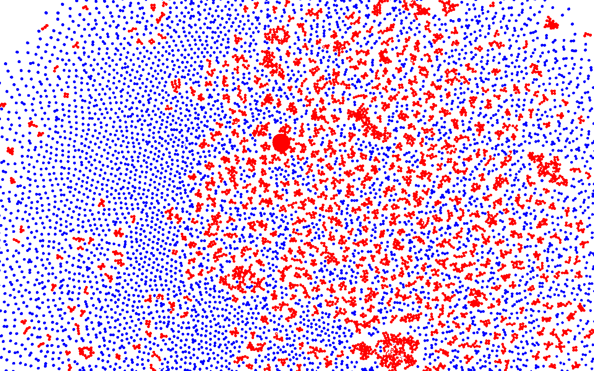

# MATLAB Cluster finder

An automated batch-processing script in MATLAB for microscopy image analysis. It processes raw microscopy frames to detect colloidal particles and classify them into single particles versus larger aggregated clusters based on area thresholds.

## Visual Comparison

| Original Microscopy Frame | Processed Cluster Classification |
| :---: | :---: |
|  |  |
| *Raw optical microscopy image* | Blue = Single Particles Red = Aggregated Clusters  |

## Key Features

* **Adaptive Image Binarization:** Handles uneven background illumination using adaptive thresholding (`imbinarize`).
* **Connected Component Analysis:** Labels isolated structures and extracts quantitative geometric properties (`bwlabel`, `regionprops`).
* **Automated Classification:**
  * **Single Particles (Blue):** Small objects ($\le 100\text{ pixels}$).
  * **Clusters / Aggregates (Red):** Connected particle groups ($> 100\text{ pixels}$).
* **Batch Processing:** Automatically iterates through all `.png` / `.jpg` images in a target directory and exports the segmented RGB visualisations.

## Getting Started

### Prerequisites
* **MATLAB** (R2019b or newer)
* **Image Processing Toolbox**

### Usage

1. Clone or download this repository.
2. Open `cluster_detection.m` in MATLAB.
3. Specify your input and output directories:
   ```matlab
   inputFolder  = 'path/to/raw_images';
   outputFolder = 'path/to/output_folder';
